## План автоматизации тестирования 

#### Объект тестирования: сценарий перехода к форме записи на обучение профессии _"Тестировщик ПО"_ и заполнения этой формы на сайте **[netology.ru](https://netology.ru/)**

#### Виды тестирования: 

- функциональное тестирование - тестирование перехода на сайт, переход на страницу профессии, возможность заполнения и отправки формы записи, в т.ч. валидации полей формы;
- тестирование удобства пользования - тестирование удобства и понятности перехода к форме записи, корректного отображения и удобство заполнения формы;
- тестирование пользовательского интерфейса - функциональная проверка интерфейса на соответствие требованиям и здравому смыслу - размер, шрифт, цвет, вёрстка.

#### Уровни тестирования:

- модульное тестирование - тестирование заполнения и отправки формы записи;
- интеграционное тестирование - взаимодействие с БД в момент заполнения и отправки формы записи (запись данных в БД);
- системное тестирование - тестирование работы сайта в целом: переход на главную страницу сайта, переход между страницами и разделами, заполнение и отправка формы записи.

### Перечень автоматизируемых сценариев:

1) Способы попасть на страницу профессии с главной страницы сайта, чтобы заполнить форму:

#### Каталог курсов

Меню _"Каталог курсов"_ -> раздел **Программирование** -> пролистать до нужной профессии - _"Тестировщик ПО"_

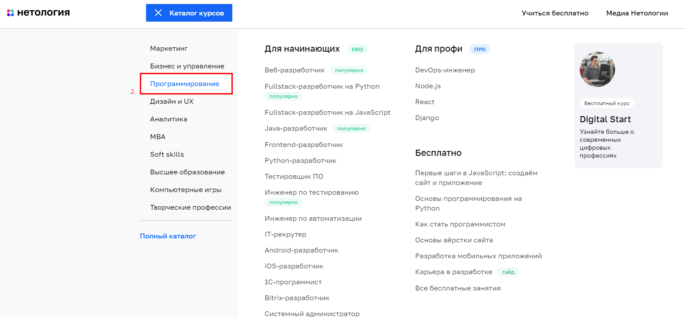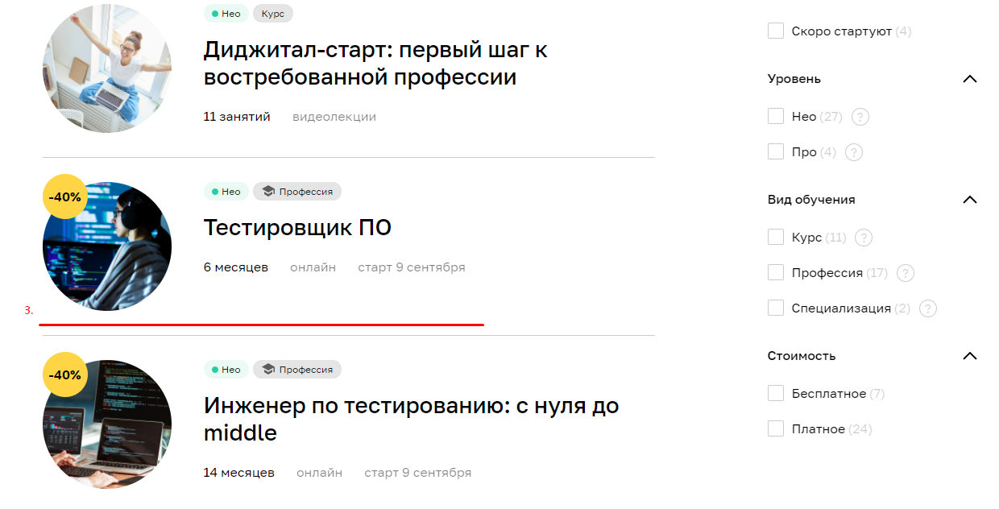

Меню _"Каталог курсов"_ -> раздел **Программирование (навести)** -> выбрать из отображённых профессий - _"Тестировщик ПО"_

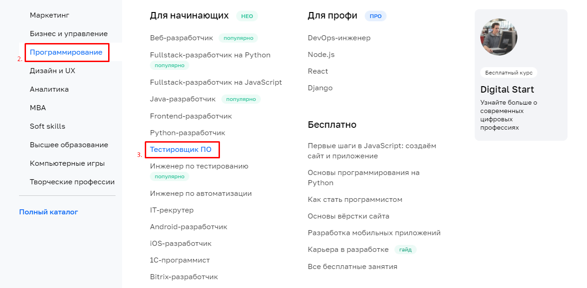

Меню _"Каталог курсов"_ -> раздел **Полный каталог** -> пролистать до нужной профессии - _"Тестировщик ПО"_

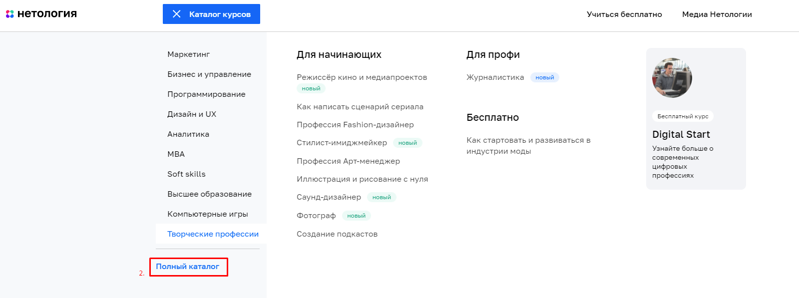

Меню _"Каталог курсов"_ -> раздел **Полный каталог** -> использовать фильтр по направлению **Программирование** - пролистать до нужной профессии - _"Тестировщик ПО"_

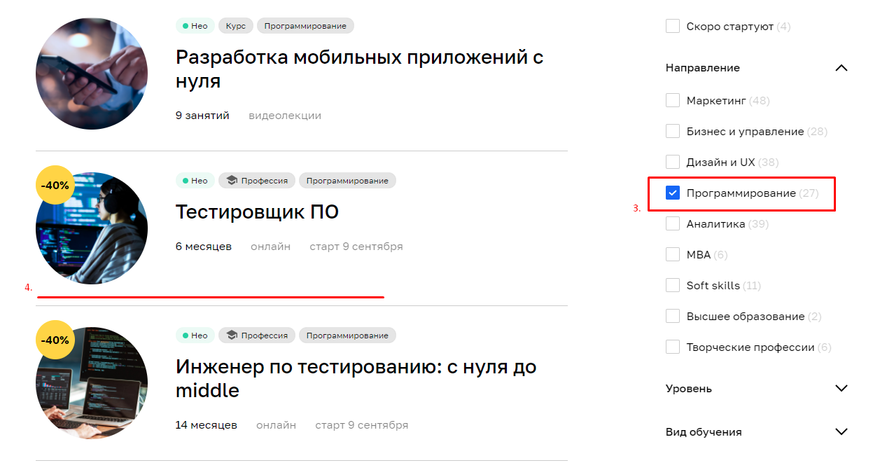

Меню _"Каталог курсов"_ -> раздел **Полный каталог** -> в поисковую строку ввести нужную профессию - _"Тестировщик ПО"_

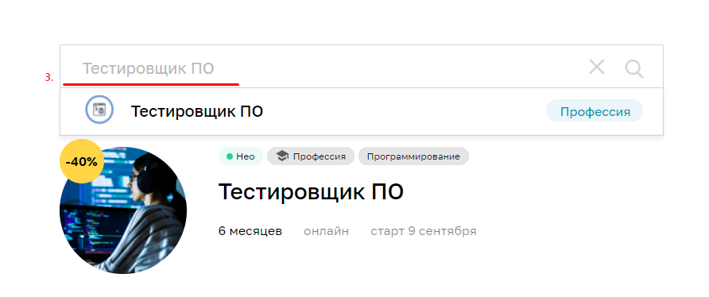

Меню _"НЕО для начинающих"_ -> пролистать до нужной профессии - _"Тестировщик ПО"_

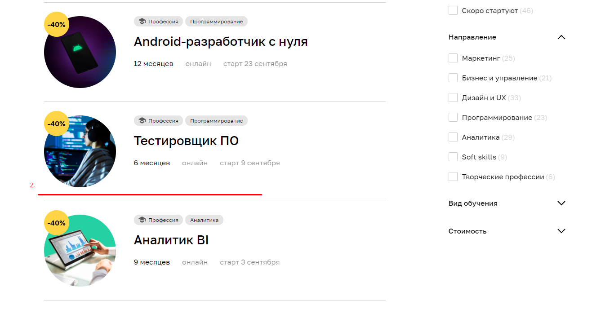

Меню _"НЕО для начинающих"_ -> использовать фильтр по направлению **Программирование** -> пролистать до нужной профессии - _"Тестировщик ПО"_

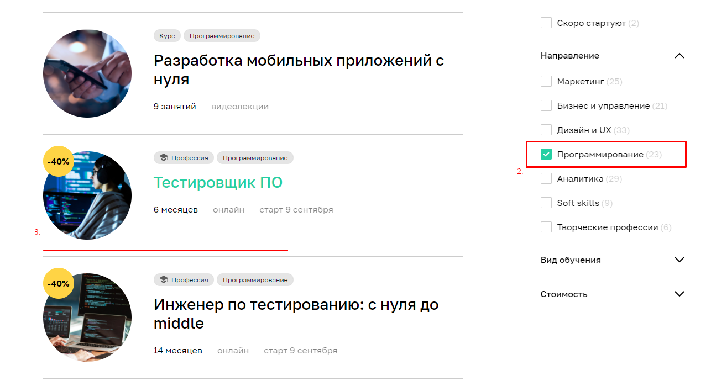

Пролистать до раздела _"Изучайте актуальные темы"_ -> тема **Программирование** -> пролистать до нужной профессии - _"Тестировщик ПО"_

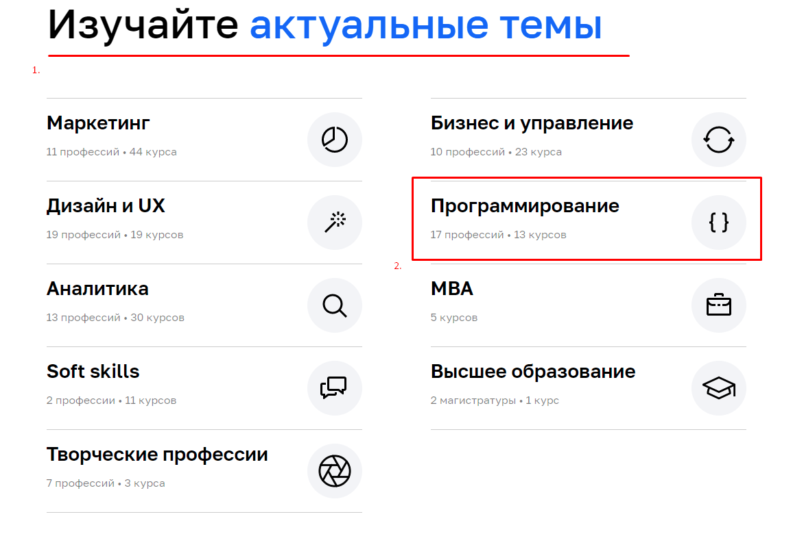

Пролистать до раздела _"Раскройте свои сильные стороны"_ -> **Выбрать курс** -> пролистать до нужной профессии - _"Тестировщик ПО"_

Пролистать до раздела _"Раскройте свои сильные стороны"_ -> **Выбрать курс** -> использовать фильтр по направлению **Программирование** -> пролистать до нужной профессии - _"Тестировщик ПО"_

Пролистать до раздела _"Раскройте свои сильные стороны"_ -> **Выбрать курс** -> в поисковую строку ввести нужную профессию - _"Тестировщик ПО"_

Пролистать в конец главной страницы -> раздел **Программирование** -> пролистать до нужной профессии - _"Тестировщик ПО"_

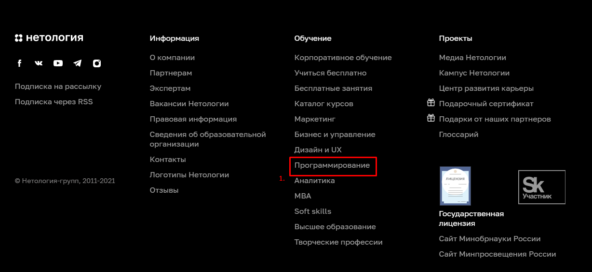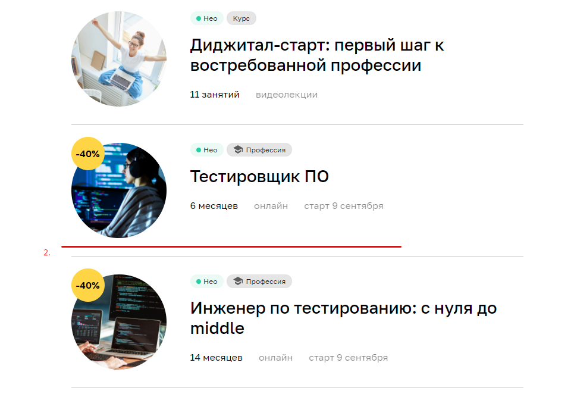

**Для тестирования путей к странице профессии необходимо 12 автотестов.**

2) Доступ к форме записи осуществляется по нажатию на кнопку **Записаться**, которая располагается в четырёх местах на странице профессии.

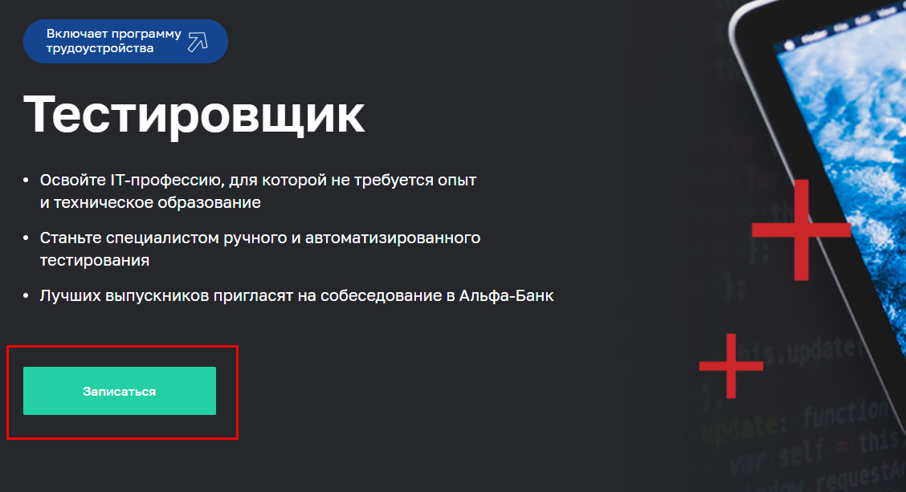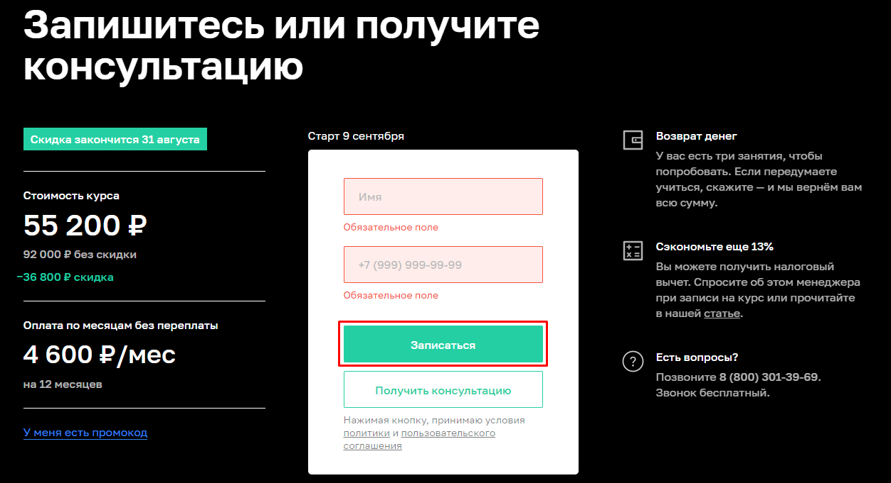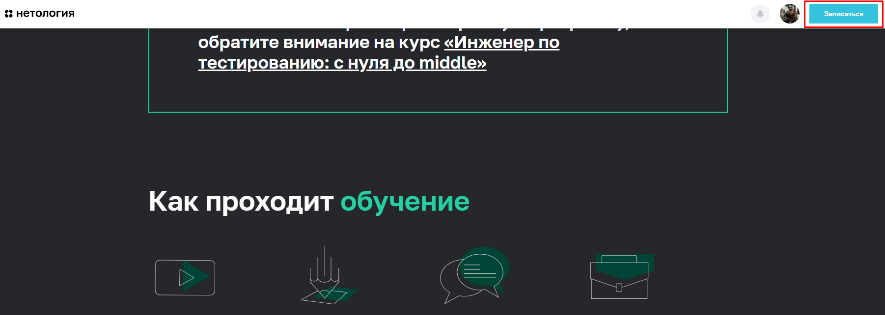

**Для тестирования работы кнопки "Записаться" на странице профессии необходимо 4 автотеста.**

3) Форма записи содержит поля **Имя** и **Номер телефона**. Необходимо протестировать позитивные и негативные сценарии заполнения и отправки формы.

Предусловия позитивных сценариев заполнения и отправки формы:
1) Перейти на **[netology.ru](https://netology.ru/)**;
2) Перейти к форме записи одним из описанных сценариев;
3) Заполнить поля формы валидными данными и нажать кнопку **Записаться**.

Ожидаемый результат:
1) Осуществлён переход на **[netology.ru](https://netology.ru/)**;
2) Открывается активная форма записи на странице профессии;
3) Поля формы заполняются валидными данными, форма отправляется по нажатию кнопки **Записаться**. На странице отображено сообщение об успешно отправке формы.

_Позитивные тесты:_
1) Валидный телефон в формате "+7 (999) 999-99-99" (далее "Валидный телефон") и минимально короткое имя;
2) Валидный телефон и двойное имя через дефис; 
3) Валидный телефон и обычное имя;
4) Валидный телефон и имя + фамилия;
5) Валидный телефон и имя с буквой "ё";

Предусловия негативных сценариев заполнения и отправки формы:
1) Перейти на **[netology.ru](https://netology.ru/)**;
2) Перейти к форме записи одним из описанных сценариев;
3) Заполнить поля формы невалидными данными и нажать кнопку **Записаться**.

Ожидаемый результат:
1) Осуществлён переход на **[netology.ru](https://netology.ru/)**;
2) Открывается активная форма записи на странице профессии;
3) Поля формы заполняются невалидными данными, у поля с введёнными невалидными данными срабатывает валидация - поле подсвечивается красным цветом и под ним отображено сообщение о возникающей ошибке. Форма не отправляется по нажатию кнопки **Записаться**.

_Негативные тесты:_
1) Пустые поля **Имя** и **Телефон**;
2) Валидное имя, но пустое поле **Телефон**;
3) Валидное имя, но невалидный телефон (цифр меньше необходимого);
4) Валидное имя, но невалидный телефон (цифр больше необходимого);
5) Валидное имя, но невалидный телефон (буквы среди цифр);
6) Валидное имя, но невалидный телефон (буквы вместо цифр);
7) Валидное имя, но невалидный телефон (специальные символы среди цифр);
8) Валидное имя, но невалидный телефон (специальные символы вместо цифр);
9) Валидное имя, но невалидный телефон (пробелы в номере);
10) Валидное имя, но невалидный телефон (все цифры одинаковые);
11) Валидный телефон, но пустое поле **Имя**;
12) Валидный телефон, но невалидное имя (количество символов превышает допустимое);
13) Валидный телефон, но невалидное имя (цифры среди букв);
14) Валидный телефон, но невалидное имя (цифры вместо букв);
15) Валидный телефон, но невалидное имя (специальные символы среди букв);
16) Валидный телефон, но невалидное имя (специальные символы вместо букв);
17) Валидный телефон, но невалидное имя (пробелы в имени);
18) Валидный телефон, но невалидное имя (все буквы одинаковые);
19) Валидный телефон, но невалидное имя (буквы разного регистра в имени);
20) Валидный телефон, но невалидное имя (буквы разных языков в имени);
21) Валидный телефон, но невалидное имя (имя на латинице).

**Итого: план автоматизации тестирования включает 3 блока и 42 автотеста**

### Перечень используемых инструментов с обоснованием выбора:
- IntelliJ IDEA - среда разработки ПО для написания кода проекта;
- Java 11 - язык программирования проекта;
- JUnit5 - библиотека для модульного тестирования ПО на языке Java;
- Git - распределённая система управления версиями, позволяет фиксировать изменения в коде;
- Gradle / Maven - системы для автоматизации сборки проектов;
- Appveyor - веб-сервис непрерывной интеграции, предназначенный для сборки и тестирования программного обеспечения расположенного на GitHub;
- Selenide - фреймворк для автоматизированного UI тестирования веб-приложений;
- SQL - язык структурированных запросов, предназначенным для описания, изменения и извлечения данных, хранимых в реляционных базах данных;
- Allure - создание наглядной отчётности по результатам тестирования.

### Перечень необходимых разрешений/данных/доступов:
1) Разрешение тестирования формы записи, создания обращений (планируется нагрузка на сервер); 
2) Тестовые данные (валидные, невалидные) для тестирования заполнения и отправки формы; 
3) Доступ к БД для проверки валидных/невалидных данных, отправляемых через форму записи.

### Перечень и описание возможных рисков при автоматизации:
1) Создание нагрузки на сервер при тестировании заполнения и отправки формы -> как следствия возможные сбои в работе сайта;
2) Проблемы с соединением/сетью (зависимость тестового окружения от бесперебойной и качественной сети Интернет);
3) Возможное отсутствие доступа к БД;
4) Тестовые данные могут попасть в настоящую БД;
5) Может требоваться рефакторинг тестов при изменениях на сайте со временем;
6) Тесты не могут покрывать все возможные тестовые сценарии.

### Перечень необходимых специалистов для автоматизации:
QA-инженер с хорошим опытом автоматизации и компетенциями работы с инструментами, которые указаны в плане.

### Интервальная оценка с учётом рисков (в часах):
- Составление тест-плана, написание и оформление документации, описание работ - **8 часов**.
- Подготовка, настройка тестового окружения, подготовка тестовых данных - **8 часов**.
- Тестирование, написание автотестов - **32 часа**. 
- Составление отчёта по результатам тестирования и автоматизации - **8 часов**.

Итого: С учётом возможных рисков и сложностей - **56 часов**.