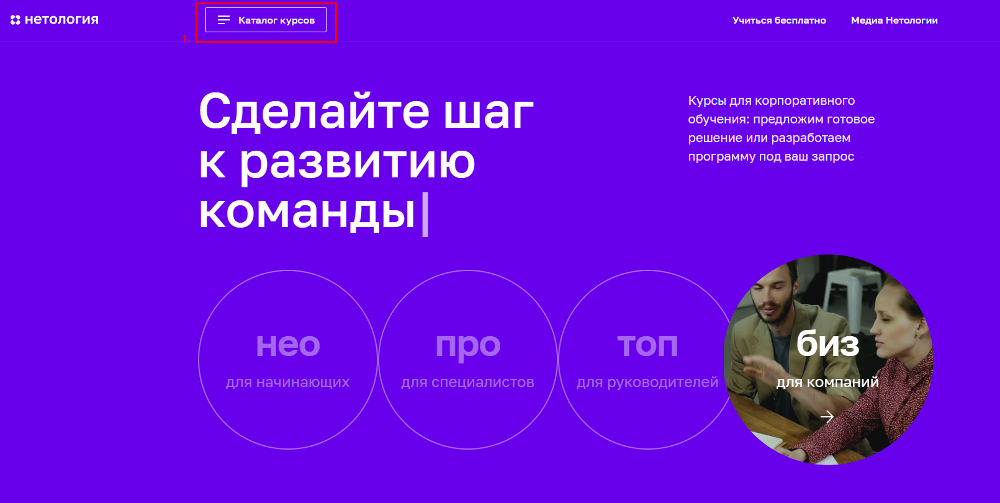

## План автоматизации тестирования 

### Объект тестирования: сценарий перехода к форме записи на обучение профессии _"Тестировщик ПО"_ и заполнения этой формы на сайте **[netology.ru](https://netology.ru/)**

### Перечень автоматизируемых сценариев:

1. Способы попасть на страницу профессии с главной страницы сайта, чтобы заполнить форму:

#### Каталог курсов

Меню _"Каталог курсов"_ - раздел **Программирование** - пролистать до нужной профессии - _"Тестировщик ПО"_

Меню _"Каталог курсов"_ - раздел **Программирование (навести)** - выбрать из отображённых профессий - _"Тестировщик ПО"_

Меню _"Каталог курсов"_ - раздел **Полный каталог** - пролистать до нужной профессии - _"Тестировщик ПО"_

Меню _"Каталог курсов"_ - раздел **Полный каталог** - использовать фильтр по направлению **Программирование** - пролистать до нужной профессии - _"Тестировщик ПО"_

Меню _"Каталог курсов"_  - раздел **Полный каталог** - в поисковую строку ввести нужную профессию - _"Тестировщик ПО"_

Меню _"НЕО для начинающих"_ - пролистать до нужной профессии - _"Тестировщик ПО"_

Меню _"НЕО для начинающих"_ - использовать фильтр по направлению **Программирование** - пролистать до нужной профессии - _"Тестировщик ПО"_

Пролистать до раздела _"Изучайте актуальные темы"_ - тема **Программирование** - пролистать до нужной профессии - _"Тестировщик ПО"_

Пролистать до раздела _"Раскройте свои сильные стороны"_ - **Выбрать курс** - пролистать до нужной профессии - _"Тестировщик ПО"_

Пролистать до раздела _"Раскройте свои сильные стороны"_ - **Выбрать курс** - использовать фильтр по направлению **Программирование** - пролистать до нужной профессии - _"Тестировщик ПО"_

Пролистать до раздела _"Раскройте свои сильные стороны"_ - **Выбрать курс** - в поисковую строку ввести нужную профессию - _"Тестировщик ПО"_

Пролистать в самый низ главной страницы - раздел **Программирование** - пролистать до нужной профессии - _"Тестировщик ПО"_

Для тестирования путей к странице профессии необходимо 12 автотестов.

Доступ к форме записи осуществляется по нажатию на кнопку **Записаться**, которая располагается в четырёх местах на странице профессии.

Для тестирования работы книпоки **Записаться** на странице профессии необходимо 4 автотеста.

Форма записи содержит поля **Имя** и **Номер телефона**. Необходимо протестировать позитивные и негативные сценарии заполнения формы.

_Позитивные тесты отправки формы:_
_Негативные тесты отправки формы:_

### Перечень используемых инструментов с обоснованием выбора:
- IntelliJ IDEA
- JAVA 11
- JUnit5
- Git
- Gradle/Maven
- CI: Appveyor/GitHub Actions
- Selenium
- Docker
- SQL
- Allure

### Перечень необходимых разрешений/данных/доступов:
- Разрешение тестирования формы записи, создание обращений (нагрузка на сервер)
- Тестовые данные (валидные, невалидные) для тестирования заполнения и отправки формы
- Доступ к БД

### Перечень и описание возможных рисков при автоматизации:
- Создание нагрузки на сервере при тестировании заполнения и отрпавки форм
- Проблемы с соединением/сетью (зависимость тестового окружения)
- Отсутствие досутпа к БД

### Перечень необходимых специалистов для автоматизации:
- QA-инженеры с опытом автоматизации

### Интервальная оценка с учётом рисков (в часах):
- 30 часов (5ч документация, описание, 5ч настройка окружения, подготовка тестовые данных, 15ч автоматизация, тестирование, 5ч отчёт по результатам тестирования).
